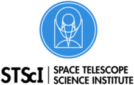

# NEXOCLOM2: Neutral EXosphere and CLOud Model 2
## Dr. Mathew Burger, Space Telescope Science Institute

------------------

### Documentation

### Installation 

There is configuration work that will need to be completed before nexoclom 
can be used. This process is given in detail below, although it is likely to 
change soon.

1. Install Anaconda Python (version >= 3.10):
   1. Download the installer from:
           https://www.anaconda.com/distribution/
   2. double-click the installer to install. This installs anaconda python in
           $HOME/anaconda3 and does not need sysadmin privileges.
   3. Verify it works: Open a new terminal window and start `ipython`. You should
see something like this:
```
(base) [sunra m🍔 /~/]$ ipython
Python 3.13.1 | packaged by conda-forge | (main, Jan  8 2025, 09:15:59) [Clang 18.1.8 ]
Type 'copyright', 'credits' or 'license' for more information
IPython 9.9.0 -- An enhanced Interactive Python. Type '?' for help.
Tip: Use `object?` to see the help on `object`, `object??` to view its source

In [1]: 
```
* NOTE: I think Anaconda python likes the bash shell, but there
are probably ways around that. 

2. Download the file [nexoclom2_environment.yml](https://stsci.box.com/s/bvb6vj0z05l4uzmm92uy8u43hdnywx8s "nexoclom_environment.yml")

3. Create the conda environment:
    ```
    (base) [sunra m🍔 /~/]$ conda env create -f nexoclom2_environment.yml
    ```
4. To use this environment run:
    ```
    (base) [sunra m🍔 /~/]$ conda activate nexoclom2
    ```
      
None of this will work if the correct environment is not active. You will 
know it's active because your prompt will change and `python` will point to a 
different executable:
    ```
    (nexoclom2) [sunra m🍔 /~/]$ which python
    /Users/mburger/anaconda/envs/nexoclom2/bin/python
    ```

5. To turn it off run:
    ```
    (nexoclom2) [sunra m🍔 /~/]$ conda deactivate
    ```

6. Create the .nexoclom file: 

In your home directory create a file called `.nexoclom2` with the following 
lines:
    ```
    savepath = <full path to saved output>/modeloutput
    database = thesolarsystemmb.db
    messengerdir = <full path to uvvs data>
    ```

7. Download the MESSENGERdata package if you're authorized (email 
    [Matthew Burger](mailto:mburger@stsci.edu))

8. Put the file in the `messengerdir` directory and untar it.
    ```
    (nexoclom) [sunra m🍔 /~/]$ tar -xvzf Level2.tar.gz
    ```
   The directory structure should be `<messengerdir>/Level2/`

9. Install nexoclom2 and MESSENGERuvvs
    ```
    pip install git+https://github.com/mburger-stsci/nexoclom2.git
    pip install git+https://github.com/mburger-stsci/MESSENGERuvvs.git
    ```
    
### Contributing

We love contributions! nexoclom2 is open source,
built on open source, and we'd love to have you hang out in our community.

**Imposter syndrome disclaimer**: We want your help. No, really.

There may be a little voice inside your head that is telling you that you're not
ready to be an open source contributor; that your skills aren't nearly good
enough to contribute. What could you possibly offer a project like this one?

We assure you - the little voice in your head is wrong. If you can write code at
all, you can contribute code to open source. Contributing to open source
projects is a fantastic way to advance one's coding skills. Writing perfect code
isn't the measure of a good developer (that would disqualify all of us!); it's
trying to create something, making mistakes, and learning from those
mistakes. That's how we all improve, and we are happy to help others learn.

Being an open source contributor doesn't just mean writing code, either. You can
help out by writing documentation, tests, or even giving feedback about the
project (and yes - that includes giving feedback about the contribution
process). Some of these contributions may be the most valuable to the project as
a whole, because you're coming to the project with fresh eyes, so you can see
the errors and assumptions that seasoned contributors have glossed over.

Note: This disclaimer was originally written by
[Adrienne Lowe](https://github.com/adriennefriend) for a
[PyCon talk](https://www.youtube.com/watch?v=6Uj746j9Heo), and was adapted by
nexoclom based on its use in the README file for the
[MetPy project](https://github.com/Unidata/MetPy>).
