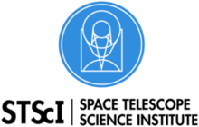

# NEXOCLOM: Neutral EXosphere and CLOud Model
## Dr. Mathew Burger, Space Telescope Science Institute

------------------

### Documentation

https://nexoclom.readthedocs.io/en/latest/ (Reasonably complete and up to date).
[This part about writing inputfiles](https://nexoclom.readthedocs.io/en/latest/nexoclom/inputfiles.html) is particularly useful.

### Installation 

There is configuration work that will need to be completed before nexoclom 
can be used. This process is given in detail below, although it is likely to 
change soon.

**I am working on a script to clean up the installation process**

1. Install Anaconda Python (version >= 3.10):
   1. Download the installer from:
           https://www.anaconda.com/distribution/
   2. double-click the installer to install. This installs anaconda python in
           $HOME/anaconda3 and does not need sysadmin privileges.
   3. Verify it works: Open a new terminal window and start `ipython`. You should
see something like this:
```
(base) [sunra m🍔 /~/]$ ipython
Python 3.10.12 | packaged by conda-forge | (main, Jun 23 2023, 22:41:52) [Clang 15.0.7 ]
Type 'copyright', 'credits' or 'license' for more information
IPython 8.14.0 -- An enhanced Interactive Python. Type '?' for help.

In [1]: 
```
* NOTE: I think Anaconda python likes the bash shell, but there
are probably ways around that. 

 2. Clone the nexoclom2 git repository:
     ```
     $ git clone https://github.com/mburger-stsci/nexoclom2.git
     ``` 
     
3. In a text editor, update the last two lines
    ```
    variables:
        PGDATA: /user/mburger/.postgres/main
        NEXOCLOMCONFIG : /user/mburger/.nexoclom
    ```
   
    For prefix, you want `$HOME/anaconda3/...`, but `$HOME` needs to be the
    specific path.

3. Create the conda environment:
    ```
    (base) [sunra m🍔 /~/]$ conda env create -f nexoclom_environment.yml
    ```
 4. To use this environment run:
    ```
    (base) [sunra m🍔 /~/]$ conda activate nexoclom2
    WARNING: overwriting environment variables set in the machine
    overwriting variable PGDATA
    ```
    Activating nexoclom sets the environment variables `PGDATA` and 
    `NEXOCLOMCONFIG`
      
None of this will work if the correct environment is not active. You will 
know it's active because your prompt will change and `python` will point to a 
different executable:
    ```
    (nexoclom2) [sunra m🍔 /~/]$ which python
    /Users/mburger/anaconda/envs/nexoclom2/bin/python
    ```

6. To turn it off run:
    ```
    (nexoclom2) [sunra m🍔 /~/]$ conda deactivate
    ```

7. Create the .nexoclom file: 

In your home directory create a file called `.nexoclom` with the following lines:
    ```
    savepath = <fullpath>/modeloutputs
    datapath = <fullpath>/ModelData
    database = thesolarsystemmb
    port = 5432
    mesdatapath = <fullpath>/UVVSData
    mesdatabase = messengeruvvsdb
    ```

`<fullpath>` does not need to be the same in all lines, but the directories all
need to be valid. If `port` is not specified, the default port 5432 will be used.

4. Initialize the postgres server if necessary:

Execute the following commands
    ```
    (nexoclom) [sunra m🍔 /~/]$ initdb -D $PGDATA
    (nexoclom) [sunra m🍔 /~/]$ pg_ctl -o "-p <port>" -l $PGDATA/logfile start
    (nexoclom) [sunra m🍔 /~/]$ createdb <username>
    (nexoclom) [sunra m🍔 /~/]$ createdb thesolarsystemmb
    (nexoclom) [sunra m🍔 /~/]$ createdb messengeruvvsdb
    ```
  * Find `<username>` with 
    ```
     (nexoclom) [sunra m🍔 /~/]$ echo $USER
     ```
  * If using the default port, the `-o "-p <port>` can be omited.
  * This needs to match database in the `.nexoclom` file
  * This needs to match mesdatabase in the `.nexoclom` file

5. Configure the MESSENGER UVVS database if you will be making comparisons to 
MASCS/UVVS data. Unfortunately, the data products being used here are not 
publicly available (I don't own this data reduction). UVVS data is available 
from the [Planetary Data System](https://atmos.nmsu.edu/data_and_services/atmospheres_data/MESSENGER/messenger.html), but it would
take some work to get it integrated into the database. We could probably work
something out if you want to compare with the data.

    1. Download the MESSENGERdata package if you're authorized (email 
    [Matthew Burger](mailto:mburger@stsci.edu))
    2. Put the file in the `mesdatapath` directory and untar it.
        ```
        (nexoclom) [sunra m🍔 /~/]$ tar -xvzf Level1.tar.gz
       ```
    3. Then run:
        ```
        (nexoclom) [sunra m🍔 /~/]$ ipython
        Python 3.8.13 | packaged by conda-forge | (default, Mar 25 2022, 06:06:49)
        Type 'copyright', 'credits' or 'license' for more information
        IPython 8.2.0 -- An enhanced Interactive Python. Type '?' for help.

        In [1]: from MESSENGERuvvs import initialize_MESSENGERdata

        In [2]: initialize_MESSENGERdata()
        ```

    This will take a while to run (hours probably).

6. To install updates from github run:
    ```
    (nexoclom) [sunra m🍔 /~/]$ pip install 
    (nexoclom) [sunra m🍔 /~/]$ pip install --upgrade MESSENGERuvvs
    ```
   or to update everything:
   ```
   (nexoclom) [sunra m🍔 /~/]$ conda env update -f nexoclom_environment.yml
   ```

7. There are some test files at https://github.com/mburger-stsci/nexoclom/tree/master/test_files/. Download them to any 
  working directory. Edit the `model_testing.py` so that *inputfile* points to 
  directory with the `Ca.isotropic.flat.input`. Then do:
   ```
   (nexoclom) [sunra m🍔 /~/]$ python model_testing.py
   ```
   This should produce something that looks like https://www.stsci.edu/~mburger/nexoclom/Ca_Oribt3576_nexoclom.html

### Contributing

We love contributions! nexoclom is open source,
built on open source, and we'd love to have you hang out in our community.

**Imposter syndrome disclaimer**: We want your help. No, really.

There may be a little voice inside your head that is telling you that you're not
ready to be an open source contributor; that your skills aren't nearly good
enough to contribute. What could you possibly offer a project like this one?

We assure you - the little voice in your head is wrong. If you can write code at
all, you can contribute code to open source. Contributing to open source
projects is a fantastic way to advance one's coding skills. Writing perfect code
isn't the measure of a good developer (that would disqualify all of us!); it's
trying to create something, making mistakes, and learning from those
mistakes. That's how we all improve, and we are happy to help others learn.

Being an open source contributor doesn't just mean writing code, either. You can
help out by writing documentation, tests, or even giving feedback about the
project (and yes - that includes giving feedback about the contribution
process). Some of these contributions may be the most valuable to the project as
a whole, because you're coming to the project with fresh eyes, so you can see
the errors and assumptions that seasoned contributors have glossed over.

Note: This disclaimer was originally written by
[Adrienne Lowe](https://github.com/adriennefriend) for a
[PyCon talk](https://www.youtube.com/watch?v=6Uj746j9Heo), and was adapted by
nexoclom based on its use in the README file for the
[MetPy project](https://github.com/Unidata/MetPy>).
