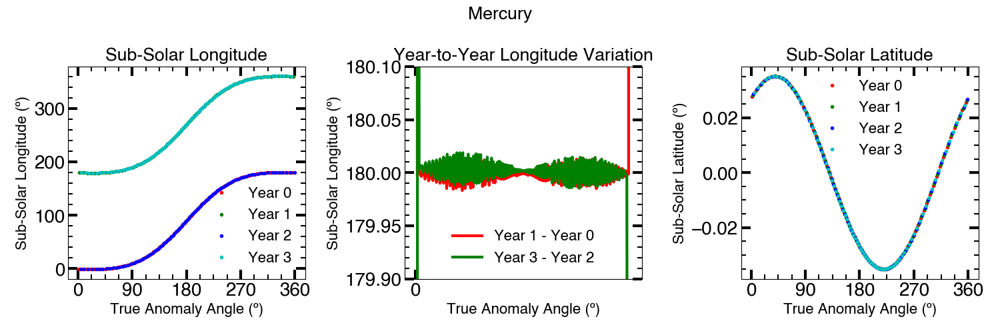

.. _coordinate_systems:

************************************************
Planetary Coordinate Systems and System Geometry
************************************************

Mercury
-------

Mercury's rotational period and orbital period are in a 2:3 resonance: two
Mercury days are equal to three Mercury years. The consequence of this is that
the sub-solar longitude on Mercury is a double-valued function of true anomaly
angle. If the sub-solar longitude is :math:`\lambda` at true anomaly :math:`\nu`
one year, then it will be :math:`\lambda + 180^\circ` (modulo 360º) the
following year and :math:`\lambda` the year after that. This is illustrated
below:

Also shown is Mercury's sub-solar latitude, which is always near-zero due to the
lack of any significant axial tilt.

Coordinate Systems on a Planet
------------------------------

The coordinate system used for the object's latitude and longitude depends
on whether the packets are ejected from a planet or a moon. For planets, a
solar-fixed coordinate system is used where the longitude increases in the
positive direction from the sub-solar point (noon) point to dusk point: ::

    sub-solar (noon) point = 0 rad = 0°
    dusk point (leading) = π/2 rad = 90°
    anti-solar (midnight) point = π rad = 180°
    dawn point (trailing) = 3π/2 rad = 270°

Latitude ranges from -π/2 rad to π/2 rad for the south pole to the north pole.
All angular values are given in radians in the input file.

Coordinate Systems on a Moon
------------------------------

For satellites, the coordinate system is planet-fixed from the sub-planet
point increasing positive through the leading point: ::

    sub-planet point = 0 rad = 0°
    leading point = π/2 rad = 90°
    anti-planet point = π rad = 180°
    trailing point = 3π/2 rad = 270°

Latitude ranges from -π/2 rad to π/2 rad for the south pole to the north pole.
All angular values are given in radians in the input file.
