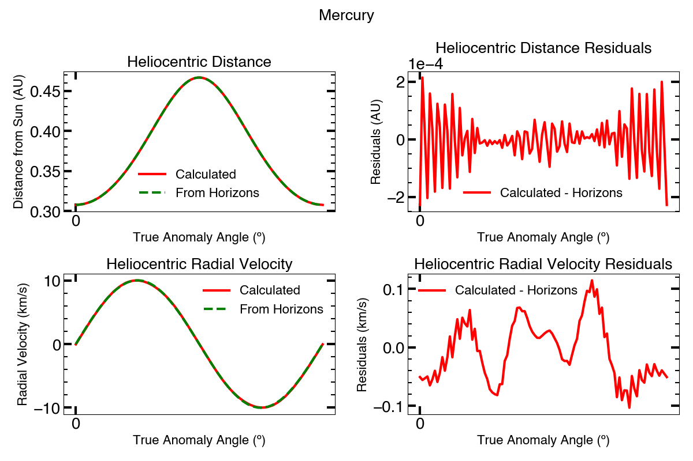
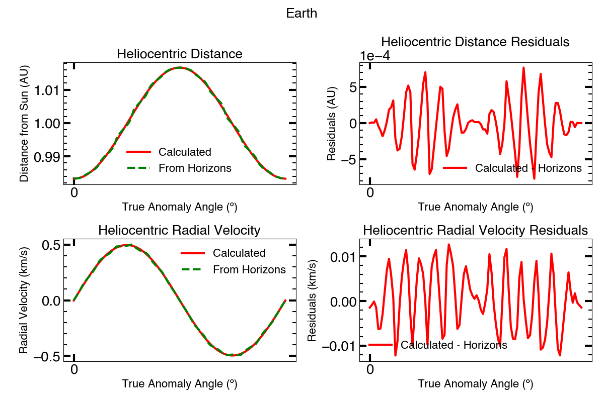
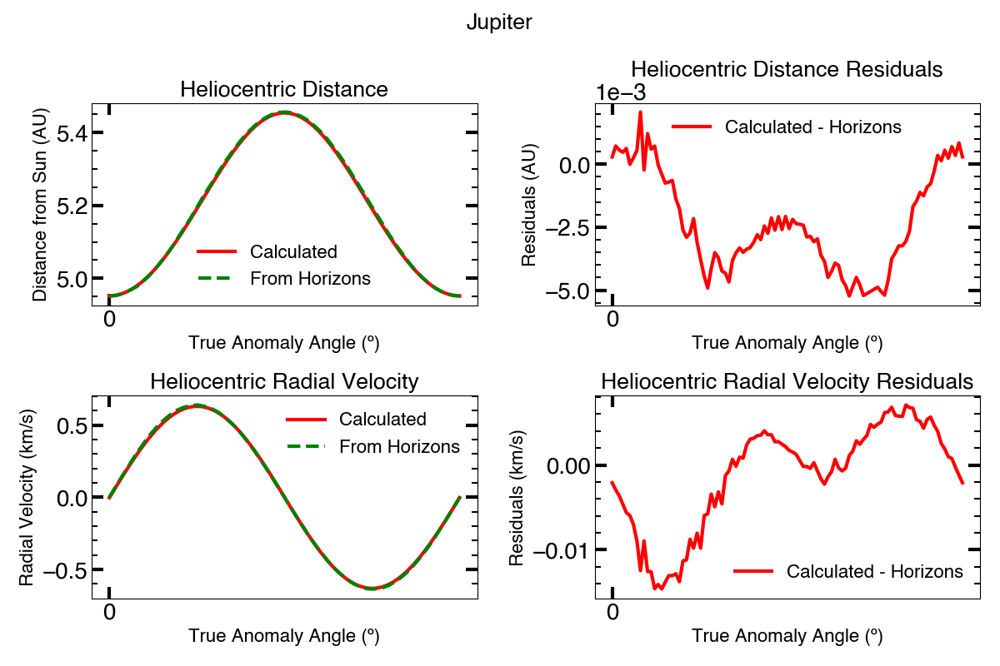
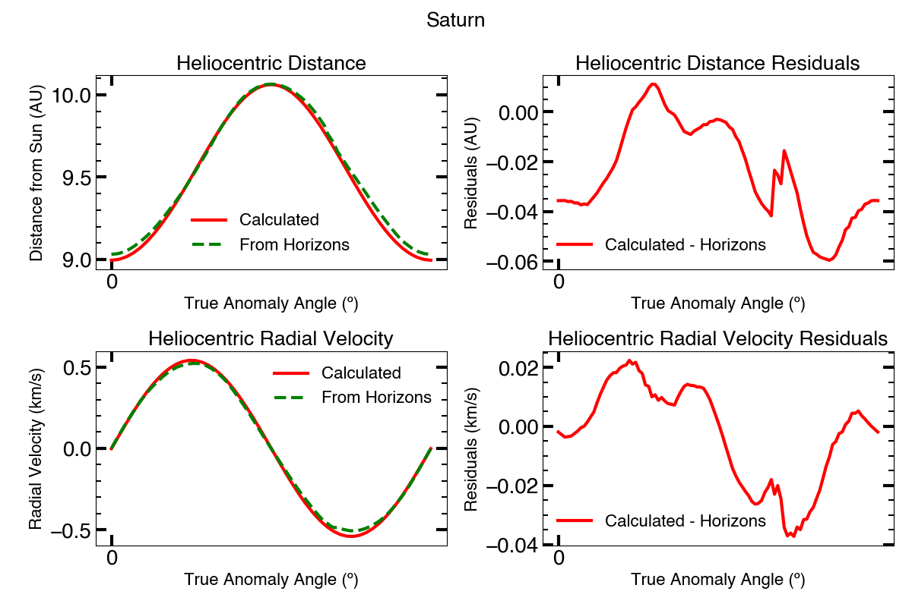

.. _planetdistance:

***********************
Solar System Geometries
***********************

The positions of each body relative to another is handled with the ``SSObject``
object combined with a ``Geometry`` object.

=================  ===========    =============  ============  ===========
Center/Object      Sun/Planet    Planet/Planet   Planet/Moon   Moon/Moon
=================  ===========   ==============  ============  ===========
taa                planet TAA    planet TAA      planet TAA    planet TAA
phi                planet TAA    planet TAA      moon sslon    moon sslon
x, y, z            Sun frame     Planet frame    Planet frame  Moon frame
vx,  vy, vz        Sun frame     Planet frame    Planet frame  Moon frame
r_sun, drdt_sun    Planet Rel.   Planet Rel.     Planet Rel.   Moon Rel.
                   to Sun        to Sun          to Sun        to Sun
subsolar_longitude Planet sslon  Planet sslon    Planet sslon  Planet sslon
subsolar_latitude  Planet sslat  Planet sslat    Planet ssatn  Planet sslat
sun_dir_x, _y, _z  Sun frame     Planet frame    Planet frame  Moon frame
==================  ===========  =============   ============  ============

Sun frame: x-axis points toward perihelion, y-axis points toward TAA=90º,
z-axis points along planet rotational axis. Origin = Solar center

Planet frame: x-axis points toward Sun, y-axis points toward dusk, z-axis
points along rotational axis. Origin = Planet center.

Moon frame: x-axis points toward Sun, y-axis points toward dusk, z-axis
points along rotational axis. Origin = Moon center.

Computing Distance and Radial Velocity of a Planet Relative to the Sun
***************************************************************

The distance from the central body as a function of true anomaly is given by:

.. math::

    r = a \frac{1 - e^2}{1 + e \cos \nu}

where *r* is the distance from the central body, *a* is the semi-major axis of
the orbit, *e* is the eccentriciy, and *ν* is the true anomaly.

To calculate the :math:`dr/dt`, the radial velocity relative to the central
body, it is necessary to determine the mean anomaly from the true anomaly as
the true anomaly does not increase at a constant rate. The mean anomaly, *M* does
increase at a constant rate. The mean anomaly as a function of time is simply

.. math::

    M(t) = 2\pi \frac{t}{P}

where *P* is the planet's orbital period. The true anomaly can be approximated
from the mean anomaly with:G

.. math::

    \nu = M + (2e - \frac{1}{4}e^3) \sin M + \frac{5}{4}e^2 \sin 2M +
    \frac{13/12} e^3 \sin 3M + \mathcal{O}(e^4)

This allows one to compute :math:`dr/dt` using the equation for *r* above.

A comparison of distance and radial velocity relative to the Sun computed
using the above equations and retrieved from
`JPL Horizons <https://astroquery.readthedocs.io/en/latest/jplhorizons/jplhorizons.html>`_
for Mercury, Earth, Jupiter and Saturn are shown here:

