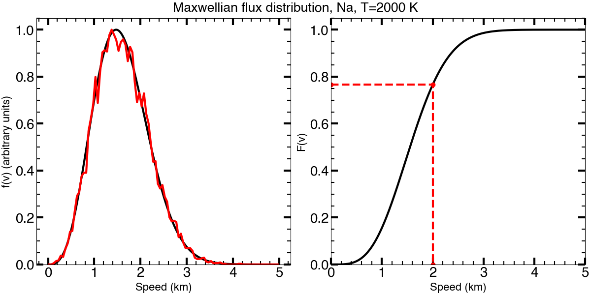

.. _randomdeviates:

***************
Random Deviates
***************

-------------
One Dimension
-------------

To choose random deviates in one dimension for an arbitrary probability 
distribution function :math:`f(x)`\ , NEXOCLOM2 uses the *Transfomration 
Method* (Numerical Recepies, 3rd edition, Ch. 7.3.2).

one first creates the cumulative distribution function
:math:`F(x)`
scaled from 0 to 1. The function :math:`f(x)` does not need to be normalized
such that it's integral is 1. The left side of the figure below shows an
unnormalized
2000 K Maxwellian flux distribution for sodium. The right side shows the
cumulative flux distribution. 

To choose a random speed from this distribution, use a random number generator 
to pick a number :math:`\eta` between zero and one. Then find the speed 
:math:`\nu` such that :math:`F(\nu)=\eta` (red lines in right panel). The 
greater the slope of 
:math:`F(x)`\ , the greater the probability of a number between 
:math:`x` and :math:`x+dx` is chosen. The red line in the left panel shows 
a histogram derived from speeds chosen randomly from this distribution. The 
more points chosen, the closer the derived histogram will match the initial 
probability distribution.

--------------
Two Dimensions
--------------

In two dimensions, NEXOCLOM2 uses the acceptance/rejection method 
(e.g., https://en.wikipedia.org/wiki/Rejection_sampling). This method works by 
choosing random values *x* and *y* from uniform distributions bounded by the 
limits on *x* and *y*, and *\mu* randomly chosen beween 0 and 1. If 
:math:`\mu < f(x, y)` where :math:`f(x, y)` is the two-dimensional 
probability distribution function, then the point is accepted; otherwise it is
rejected. The process continues until the desired number of points have been
chosen. In practice many points can be chosen at once and it is not necessary 
to perform a long loop in Python. 

==========================
Two Dimensions on a Sphere
==========================

Choosing points from an arbitrary distribution on a sphere is more complicated. 
